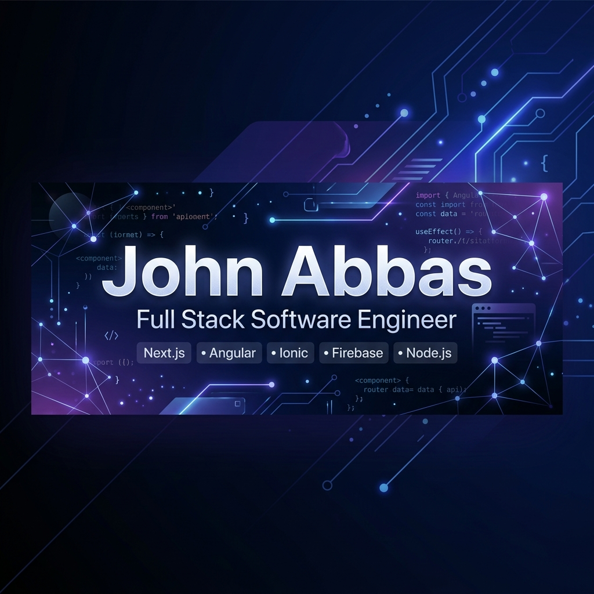

  

  

  
  
  

---

### 📖 About Me

I am a **Full Stack Software Engineer** at **DouzeTech**, specialized in architecting and delivering high-performance web and mobile platforms. I design secure databases, establish clean APIs, and create high-converting administrative portals and mobile interfaces.

- 🏗️ **Architectural Focus:** Decoupled frontend components, SOLID principles, and clean modular designs.
- ⚙️ **Backend Reliability:** Building highly secure endpoints, designing optimized query patterns, and database layouts.
- 🤝 **Business Impact:** Transforming operational needs (like logbooks, billing systems, and tracker sheets) into optimized production-ready services.

---

### 🔭 Currently Working On

I actively develop and maintain corporate products, admin tooling, and mobile-native workflows:

*   🏢 **Building Management System:** Core resident-visitor flow manager using **Ionic**, **Angular**, and **Firebase** push services.
*   🏠 **Property Management Portal:** Multi-tenant dashboard built with **Next.js**, **TypeScript**, and **MySQL**.
*   📦 **Courier Management System:** Package logs, customer parcel search timelines, and tracking tools.
*   🛒 **POS System:** Integrated high-throughput retail register checkout, inventory level warnings, and transaction databases.
*   🌐 **DouzeTech Website:** Re-architecting highly responsive user portals and landing layouts with optimized animations.

---

### 📚 Currently Learning

Continuous upskilling is central to my development workflow. I am currently focused on:

*   🤖 **AI Integrations:** Embedding Large Language Model (LLM) agents and cognitive pipelines into administrative web modules.
*   🐳 **Docker & Containers:** Orchestrating local builds and microservices setups to streamline server environments.
*   ☁️ **Azure Cloud Services:** Provisioning managed SQL instances, App Service deployments, and serverless background tasks.
*   🔄 **CI/CD Pipelines:** Structuring robust GitHub Actions configurations to perform linting, integration testing, and automatic builds.

---

### 🛠️ Tech Stack & Tooling

  

---

### 🏆 Developer Badges & Achievements

  
  
  
  
  

---

### 📊 GitHub Activity & Insights

  

<table align="center">
  <tr>
    <td align="center" width="50%">
      
    </td>
    <td align="center" width="50%">
      
    </td>
  </tr>
  <tr>
    <td align="center" colspan="2">
      
    </td>
  </tr>
</table>

---

### 👾 Contribution History

  

---

### 📩 Let's Connect

  
  
  
  

